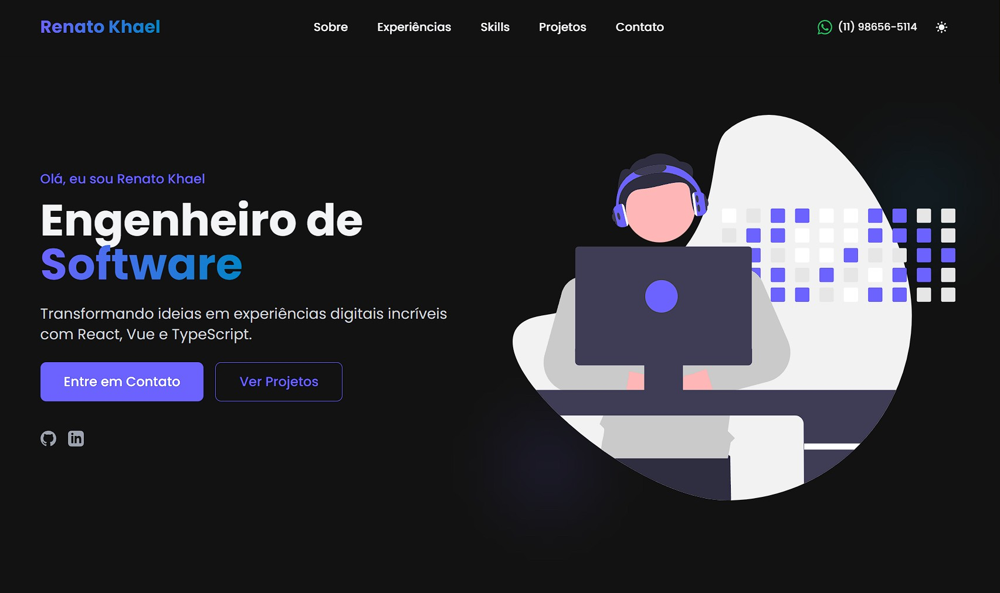

# Renato Khael | Software Engineer Portfolio



## 📋 Overview

A modern and responsive portfolio website built with Astro and React, showcasing professional experience, skills, and projects. This portfolio provides a clean, user-friendly interface for visitors to learn about Renato Khael's expertise as a Senior Frontend Developer.

## 🚀 Features

- **Responsive Design**: Fully optimized for all devices and screen sizes
- **Modern UI**: Clean and professional interface with smooth animations
- **Dark/Light Mode**: Theme switching capabilities for better user experience
- **Interactive Components**: Dynamic sections to showcase skills and projects
- **Performance Optimized**: Built with Astro for excellent performance metrics
- **SEO Friendly**: Structured metadata for better search engine visibility

## 🛠️ Tech Stack

- **Framework**: [Astro](https://astro.build/)
- **UI Library**: [React](https://reactjs.org/)
- **Styling**: [TailwindCSS](https://tailwindcss.com/)
- **Typography**: [Poppins](https://fonts.google.com/specimen/Poppins) from Google Fonts
- **Icons**: Custom SVG icons
- **Deployment**: Easily deployable to Vercel, Netlify, or other platforms

## 📦 Project Structure

```
/
├── public/
│   └── assets/
│       ├── images/
│       └── svgs/
├── src/
│   ├── components/
│   │   └── sections/
│   │       ├── Hero.astro
│   │       ├── About.astro
│   │       ├── Experience.astro
│   │       ├── Skills.astro
│   │       ├── Projects.astro
│   │       └── Contact.astro
│   ├── layouts/
│   │   └── Layout.astro
│   ├── pages/
│   │   └── index.astro
│   └── styles/
└── package.json
```

## 🖥️ Website Sections

- **Hero**: Introduction and call-to-action
- **About**: Personal and professional background
- **Experience**: Work history and professional achievements
- **Skills**: Technical abilities and expertise
- **Projects**: Portfolio of completed work
- **Contact**: Form and information for getting in touch

## 🚀 Getting Started

### Prerequisites

- Node.js (v16 or higher)
- npm or yarn

### Installation

1. Clone the repository:
   ```bash
   git clone https://github.com/yourusername/renato-khael.git
   cd renato-khael
   ```

2. Install dependencies:
   ```bash
   npm install
   # or
   yarn install
   ```

3. Start the development server:
   ```bash
   npm run dev
   # or
   yarn dev
   ```

4. Open your browser and navigate to `http://localhost:3000`

## 📝 Customization

This portfolio is designed to be easily customizable:

1. Update personal information in the component files
2. Replace images in the `public/assets/images` directory
3. Modify the color scheme in `tailwind.config.js`
4. Add or remove sections as needed in `index.astro`

## 🚢 Deployment

This site can be deployed to any platform that supports Astro, such as:

- Vercel
- Netlify
- GitHub Pages
- AWS Amplify

## 📄 License

This project is open source and available under the MIT License.

---

Created with ❤️ by Renato Khael

